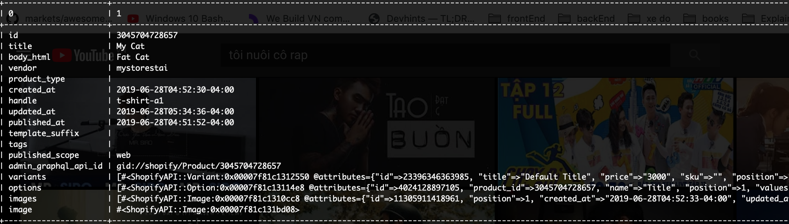
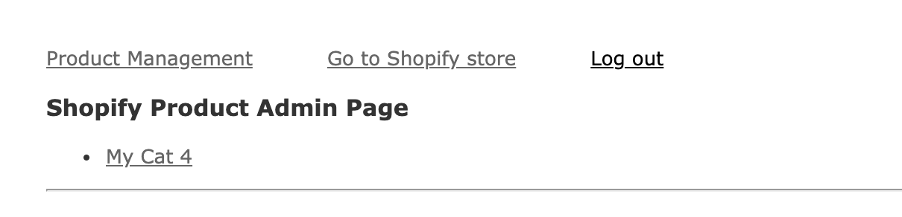
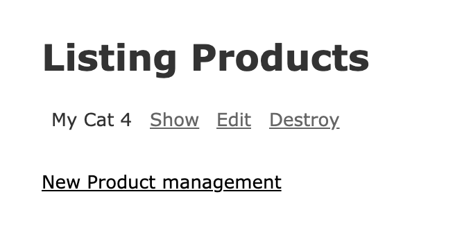

# README

Demo Shopify Application

Things you may want to cover:

* Ruby version

    - Ruby 2.6.1

* System dependencies
    - Rails 5.2.3
    - Postgresql

* Configuration
    - Install gem dependencies
    ```
    bundle install --path vendor/bundle
    ```
    - Setup Shopify API credentials
    ```
    # config/application.yml

    SHOPIFY_CLIENT_API_KEY: <api_key>
    SHOPIFY_CLIENT_API_SECRET: <api_secret>
    ```

* Database creation
    ```
    bundle exec rails db:setup
    ```

* Database initialization
    ```
    bundle exec rails db:migrate # migrate new schema
    ```
    
* Result Case study





